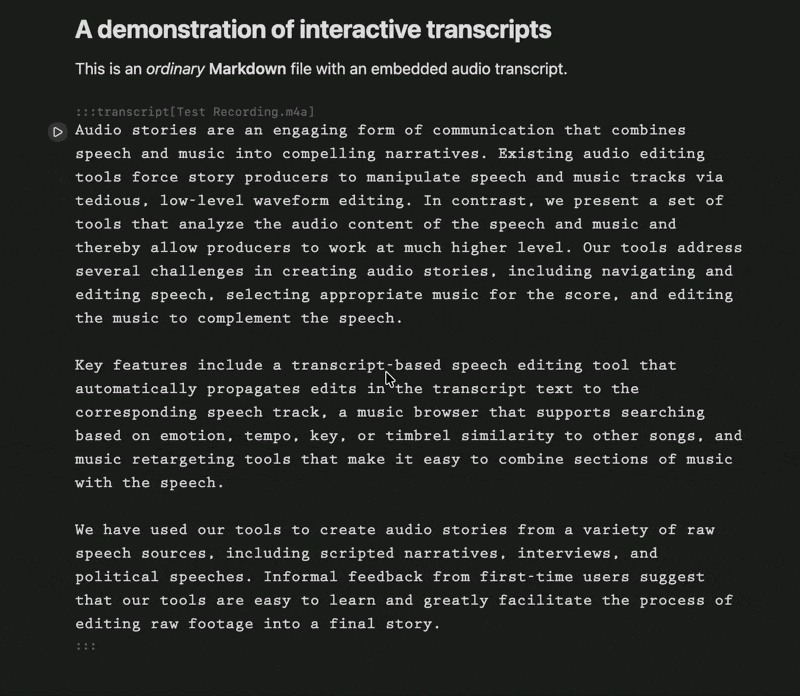

# Interactive Transcripts


This experimental Obsidian plugin lets you turn audio files into interactive editable transcripts embedded within ordinary Markdown documents.

With these transcripts, you can:
* hold Command and click anywhere in the transcript to start playing the audio file from there
* delete regions like ordinary text; audio playback will skip those segments
* copy and paste regions into other documents like ordinary text, preserving playback support
* position your cursor and press Return twice to split the transcript, so you can interleave normal Markdown

## Installation

*The plugin currently supports only Apple Silicon. If there's interest, we can add support for other transcription models.*

Install the plugin from a full release archive:

1. Download [the latest release](https://github.com/andymatuschak/interactive-transcripts/releases/latest).
2. Unzip it into your vault's `.obsidian/plugins/` folder so the plugin lives at `.obsidian/plugins/interactive-transcripts/`.
3. Restart Obsidian.
4. Enable "Interactive Transcripts" in Settings -> Community plugins.

BRAT does not currently work for this plugin because it installs only the standard Obsidian plugin files (`main.js`, `manifest.json`, and `styles.css`). This plugin also needs the bundled `python/` runtime directory.

## Basic usage

1. Embed an audio file into a document, e.g. by dragging and dropping or pasting into the editor.
2. Use the Command Palette to run "Interactive Transcripts: Transcribe audio". It will process the embedded audio under your cursor and replace it with an interactive transcript.
   * If you don't already have `uv` (a Python package manager) or `ffmpeg` (a media toolchain), the plugin will prompt you to install them.
   * The first time you transcribe audio, the plugin will prompt you to download Parakeet, a local speech transcription model (about 2.5GB).
   * If you already have Parakeet downloaded on your machine, you can provide the model path in the plugin's settings pane.
3. Click the Play button to play the transcript, or Cmd+Click on part of the transcript to play from that part.

## Markdown syntax

My aim with this plugin is to express these audio transcripts in the spirit of Markdown: human-readable, portable, and substantially human-editable. Transcripts are stored as a [Markdown directive](https://talk.commonmark.org/t/generic-directives-plugins-syntax/444/1). A typical example:

```md
# My note
This is an ordinary *Markdown* note.

:::transcript[recording.m4a]
Text of the transcript here.
:::

More ordinary Markdown here.
```

### Start and end attributes

The directive optionally supports `start` and `end` attributes, specifying the range (in seconds) of the audio file covered by the transcript, e.g.:

```md
:::transcript[a.m4a]{start=2.5}
This transcript excerpt includes speech after 00:02.500 in the audio.
:::

:::transcript[b.m4a]{end=4}
This transcript excerpt only includes speech in the audio file through 00:04.000.
:::

:::transcript[c.m4a]{start=3 end=4}
etc etc
:::
```

The editor will automatically update these attributes if you delete from the start or end of a transcript block, if you copy and paste part of a transcript elsewhere, or if you split a transcript at your cursor by pressing Return twice.

### Skip directives

The syntax also supports inline deletions using an inline `skip` directive:

```
:::transcript[file.m4a]
I had this dream that went on and on and :skip{start=2 end=2.5} on and on.
:::
```

Both `start` and `end` attributes are required for these inline directives. The editor will automatically create and update these directives if you delete text in the middle of a transcript.

## Development

Warning: this was primarily implemented by coding agents, with minimal technical oversight!

Install dependencies:

```bash
bun install
uv sync --project python
```

Run tests:

```bash
bun test
uv run --project python --with pytest pytest python/test_speechServer.py -q
```

Build the plugin bundle:

```bash
bun run build
```

Prepare a release folder and archive:

```bash
bun run release:prepare
```

## Inspirations

* [Rob Ochshorn](https://rmozone.com)'s many wonderful text/audio projects, especially [Gentle](https://rmozone.com/snapshots/2021/11/gentle-history/).
* Many papers from [Maneesh Agrawala](https://graphics.stanford.edu/~maneesh/)'s group at Stanford, especially the [Audio Stories](http://vis-ucb-maneesh.stanford.edu/papers/audiostories/) paper from Rubin et al.
* [Descript](https://www.descript.com)

## Thanks

Work on this plugin and [the talk in which it was introduced](https://andymatuschak.org/tat/) was made possible by [my Patreon community](https://patreon.com/quantumcountry).

Special thanks to my sponsor-level patrons, [Adam Marblestone](http://www.adammarblestone.org), [Adam Wiggins](https://twitter.com/hirodusk), [Andrew Sanchez](https://x.com/informandrew), [Andrew Sutherland](https://asuth.com/), Andy Schriner, [Ben Springwater](https://twitter.com/benspringwater), [Bert Muthalaly](http://somethingdoneright.net/), Boris Verbitsky, [Calvin French-Owen](http://calv.info/), [Dan Romero](https://danromero.org/), [David Wilkinson](https://david.wilkinson.xyz/about), Dylan Houlihan, [fnnch](https://fnnch.com/), Greg Vardy, [Heptabase](https://heptabase.com), [James Hill-Khurana](https://jameshk.com/), James Archer, James Lindenbaum, [Jesse Andrews](https://m4ke.org), [Kevin Lynagh](https://kevinlynagh.com/), [Kinnu](http://kinnu.xyz), [Lambda AI Hardware](https://lambdalabs.com/),  [Ludwig Petersson](https://twitter.com/ludwig), [Maksim Stepanenko](http://maksim.ms/), [Matt Knox](http://mattknox.com/), [Matt Kraning](https://www.linkedin.com/in/matt-kraning/), Michael Slade, [Mickey McManus](http://www.t-1ventures.com/),  [Mintter](http://mintter.com/), [Patrick Collison](https://patrickcollison.com/), [Peter Hartree](https://peterhartree.co.uk/), [Ross Boucher](http://rossboucher.com), [Russel Simmons](https://github.com/rsimmons/), [Salem Al-Mansoori](https://twitter.com/uncomposition), [Sana Labs](https://www.sanalabs.com/), [Thomas Honeyman](https://thomashoneyman.com/), Todor Markov, [Tooz Wu](https://twitter.com/toozwu), William Clausen, [William Laitinen](https://www.exigeinternational.com/), [Yaniv Tal](https://twitter.com/yanivgraph).
